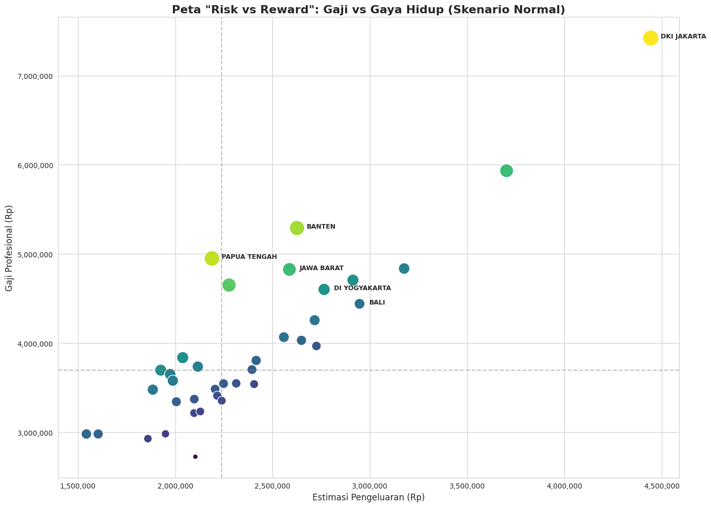
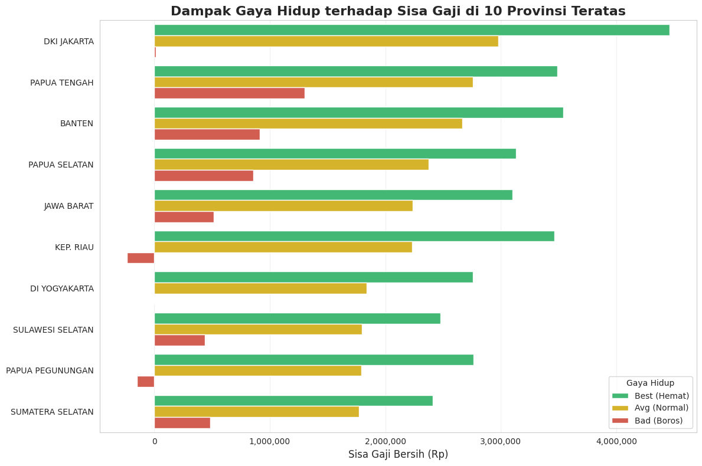
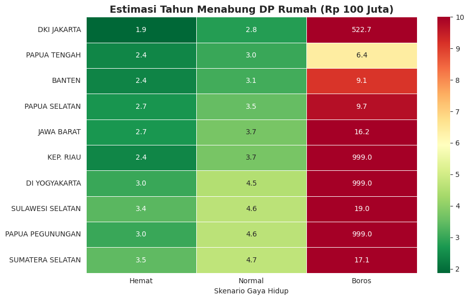

# 🇮🇩 The Gen Z Livability Index 2025

  

### 🧐 Overview
Banyak Gen Z mengeluh bahwa **"Gaji Jakarta cuma numpang lewat"**. Apakah ini fakta atau sekadar keluhan gaya hidup?

Project ini menganalisis data **Badan Pusat Statistik (BPS) 2025** untuk mencari provinsi mana di Indonesia yang memberikan keseimbangan terbaik antara **Pendapatan (Gaji Profesional)** dan **Biaya Hidup**.

Kami tidak hanya menggunakan rata-rata statistik, tapi memodelkan **3 Skenario Gaya Hidup** untuk melihat realita yang sebenarnya.

---

### 📊 Key Insights (Temuan Utama)

#### 1. Peta "Risk vs Reward"
Jakarta adalah *High Risk, High Return*. Gaji tinggi, tapi biaya hidup juga sangat tinggi. Sementara Banten & Kep. Riau menawarkan *Sweet Spot* (Gaji Tinggi, Biaya Relatif Rendah).

#### 2. Realita Gaya Hidup (The Lifestyle Trap)
Kami membandingkan sisa gaji berdasarkan 3 skenario:
* **Best Way (Hemat/BPS):** Jakarta Juara 1.
* **Average Way (Normal Gen Z):** Banten mengejar Jakarta.
* **Bad Way (Boros):** Sisa gaji di Jakarta *collapse*, kalah dengan provinsi lain.

#### 3. Kapan Kebeli Rumah?
Heatmap di bawah menunjukkan berapa tahun waktu yang dibutuhkan untuk mengumpulkan **DP Rumah (Rp 100 Juta)**.
* *Highlight:* Jika hidup boros di Jakarta, butuh waktu **>100 Tahun** (Mustahil) untuk mengumpulkan DP.

---

### 🧠 Methodology
Analisis ini menggabungkan dua dataset utama:
1.  **Income:** Rata-rata Upah Bersih Tenaga Profesional (BPS Sakernas Feb 2025).
2.  **Expense:** Pengeluaran Per Kapita Sebulan (BPS Susenas 2025).

**Formula Skenario:**
* **🟢 Best Way (Hemat):** Pengeluaran = Standar BPS (Masak sendiri, Transport umum).
* **🟡 Average Way (Normal):** Pengeluaran = 1.5x Standar BPS (Kost AC, Sesekali GoFood).
* **🔴 Bad Way (Hedon):** Pengeluaran = 2.5x Standar BPS (Apartemen, Mobil, Lifestyle tinggi).

---

### 🛠️ Tools Used
* **Language:** Python
* **Libraries:** Pandas (Data Cleaning), Matplotlib & Seaborn (Visualization)
* **Data Source:** [Badan Pusat Statistik (BPS) Indonesia](https://www.bps.go.id)

---

### 👨‍💻 Authors
* **Zahid Abdullah Nur Mukhlishin** 
